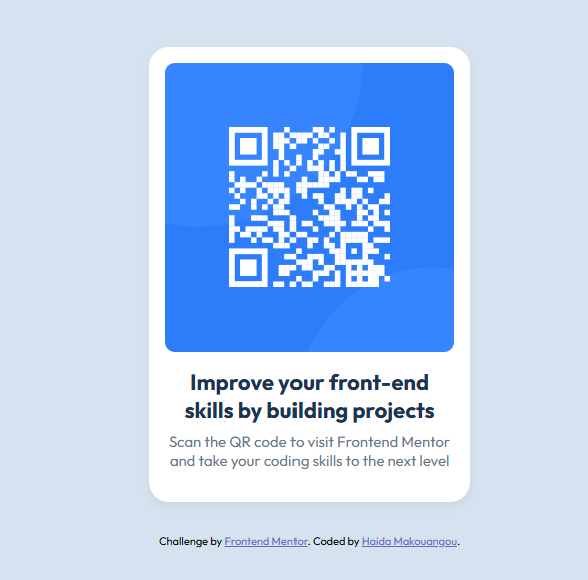

## Frontend Mentor - QR code component solution

This is a solution to the [QR code component challenge on Frontend Mentor](https://www.frontendmentor.io/challenges/qr-code-component-iux_sIO_H). Frontend Mentor challenges help you improve your coding skills by building realistic projects. 

## Table of contents

- [Overview](#overview)
  - [Screenshot](#screenshot)
- [My process](#my-process)
  - [Built with](#built-with)
  - [What I learned](#what-i-learned)
  - [Continued development](#continued-development)
  - [Useful resources](#useful-resources)
- [Author](#author)
- [Acknowledgments](#acknowledgments)

## Overview

### Screenshot

## My process

### Built with

- Semantic HTML5 markup
- CSS custom properties
- Flexbox
- Mobile-first workflow

### What I learned

This project helped reinforce my understanding of:

- Structuring HTML semantically
- Centering elements using Flexbox
- Applying consistent padding and spacing
- Following a provided design using only a JPG as a guide

### Continued development

I want to continue improving in the following areas:

- Better use of rem/em for scalable layouts
- More practice with responsive design using media queries
- Using utility classes and custom CSS variables for consistency

### Useful resources

- [MDN Web Docs](https://developer.mozilla.org/en-US/) - Great reference for HTML and CSS syntax.
- [Frontend Mentor Community](https://www.frontendmentor.io/community) - Helpful discussions and inspiration from others who completed this challenge.

## Author

- GitHub - (https://github.com/your-HaidaMarese)
- Frontend Mentor - (https://www.frontendmentor.io/profile/your-username)

## Acknowledgments

Thanks to the Frontend Mentor team for this challenge. It’s a great starting point for building real-world components!
